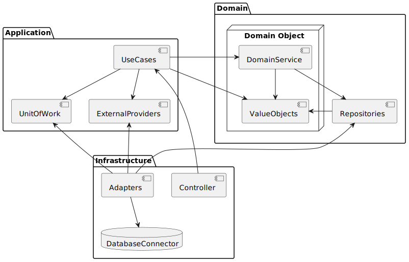
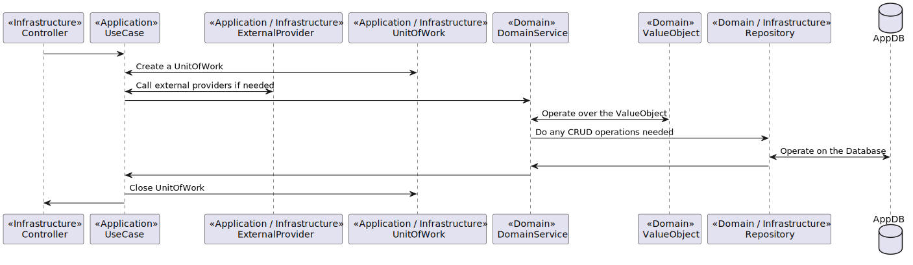

# Major Blocks

### Domain

Contains all the business rules that are the core of the business, and that do not depend on any
external factors, concretely here is where **Domain Entities**, **Domain Services**, 
**Repository Interfaces** and **Ports** will live.
There is one difference from regular clean architecture in that our **Domain Entities** 
will only have data, akin to **Value Objects** and all the domain behaviour will be implemented
by the **Domain Services** instead. 

### Application

This is where the application **Use Cases** are implemented, also, this is where we
will start the UnitOfWork to guarantee atomicity of execution for a given UseCase and
this is where we will define the contract for External Providers that may be 
necessary for the execution of the UseCases. 

### Infrastructure

This is where our **Rest Controllers**, **Repository Implementations**, etc will live, 
meaning anything that depends on a library or has any kind of dependency on third 
party code should stay in this package.

**Note:** Flask, SQLAlchemy, etc are considered infrastructure and should not be used 
directly in the **Application** or **Domain** layers, they should all be integrated 
with at this level in their own respective adapters. 

# Schematics

## Dependency Diagram

The image bellow although a little complicated and confusing, shows the dependency graph
of all the major parts of the architecture and how they depend on each other. 

## Execution Diagram

The bellow sequence diagram shows what parts will be called and in which order for a 
general request to an entry point. 

# Drill Down into Packages

## Domain

Has explained previously, the Domain package contains the core business rules of
the system, and does not depend on any other packages/modules.

### Domain App Module

Think of an App Module as you would of a Bounded Context in Domain Driven Design,
it is a functional division of the application responsible for an aggregate.
In each of these Modules we will have the core business rules for a given context 
of the system. 

#### Models

This module contains all the entities used in the Domain package, do not confuse 
these entities as Domain Entity, you should think of these entities more as 
ValueObjects instead. 

#### Repositories

This module contains all the Repository interfaces, and these
Repositories will eventually be implemented in the Infrastructure package. 

#### Services / Business Rule

This module contains the Domain Services (Business Rules), these Services contain
the Business Rules for a given entity, note that these services should not have any
state, being only built with functionality instead. 

### Shared

This module has the base BusinessRule and Repository interfaces that will be 
implemented or extended either at the Domain level (Business Rules) or at the
Infrastructure level (Repositories).

## Application

This package contains the application business rules, it is here that we will implement
the systems functionality, also it is here that we will start the UnitOfWork and it
is here that we will integrate with external systems as well, at least at an 
interface level.

**Note:** UseCases should not know the specifics (implementations) of the 
UnitOfWork and ExternalProviders, it should only be aware of the contract (interface).

### Application App Module

See: [Domain App Module](#domain-app-module) for the base information. 
This App Module has the same responsibility but it deals with the Application level
data structures and services. 

#### Use Cases

This is where we implement the applications UseCases and business rules. Note that
these UseCases should not depend on specific implementations of UnitOfWork and
ExternalProvider interfaces. 

#### DTO

This is where we will have all the DTOs and **DTOs <-> Entity** translators will
be implemented for this Context. 

#### External Providers

This is an optional module, being that it will not always be needed, but it is here
that we will implement the contract (Interface) for a given External Provider, 
keep in mind that these External Provider interfaces are specific to each case, 
**ex:** Login execution on an external IAM provider. 

### Shared

This module is where we implement the interfaces for UnitOfWork and UnitOfWorkProviders,
and any other necessities for the proper functioning and loose coupling of the
application level code, such as Log apis, or monitoring apis for external log and
monitoring providers. 

## Infrastructure

At the base level of this package there may exist modules that make sense to be 
shared, like UnitOfWork implementations, utils, translators and all others that
might be necessary to make the application work with external dependencies, such
as Web Servers, Databases, Queues, Sidecars, etc. 

### Infrastructure App Module

See: [Application App Module](#application-app-module)

#### Adapters

This module contains the concrete implementations of the interfaces defined in
the Domain and Application layers, such as Repositories, External Providers, etc. 

#### Entry Points

This module contains all the entry points available for a given Context, these
Entry Points can be REST APIs, Queue Consumers, Subscribers, Web Sockets or
any other entry points that make sense for the desired functionality. 

