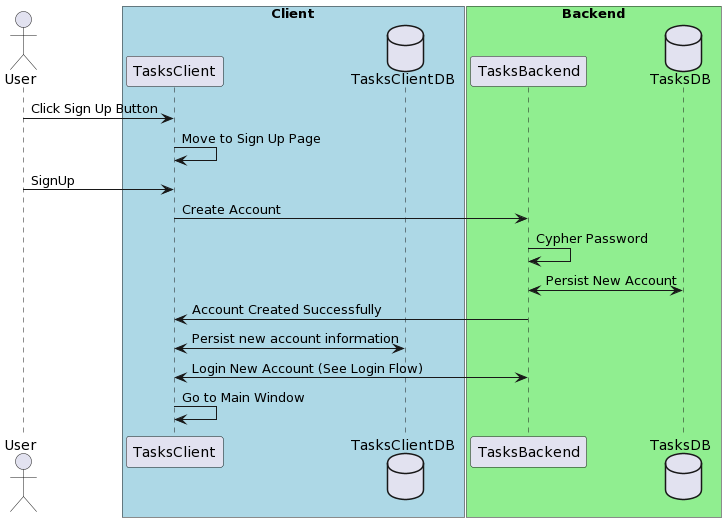

# Create Account

## Description

This feature allows new users of the application to register new accounts allowing
them to use the syncronization between devices. 

## Problem Being Solved

This solves the issues of syncronization between devices for the users, by allowing
their accounts to be identified and setting them as owners of their accounts. 

## Sequence Diagram



## Sequence Diagram Code

```
@startuml

actor User

box "Client" #LightBlue
  participant TasksClient
  database TasksClientDB
end box

box "Backend" #LightGreen
  participant TasksBackend
  database TasksDB
end box

User -> TasksClient: Click Sign Up Button
TasksClient -> TasksClient: Move to Sign Up Page
User -> TasksClient: SignUp
TasksClient -> TasksBackend: Create Account
TasksBackend -> TasksBackend: Cypher Password
TasksBackend <-> TasksDB: Persist New Account
TasksBackend -> TasksClient: Account Created Successfully
TasksClient <-> TasksClientDB: Persist new account information
TasksClient <-> TasksBackend: Login New Account (See Login Flow)
TasksClient -> TasksClient: Go to Main Window

@enduml
```