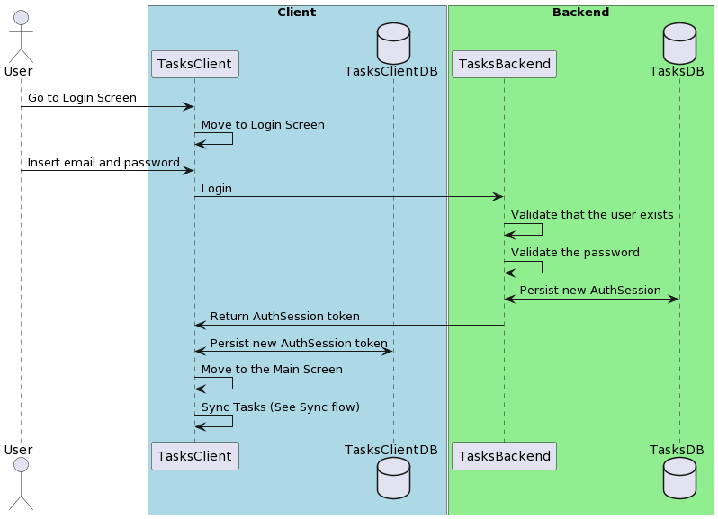

# Login

## Description

This feature allows the users to login into the application and to synchronize their tasks between
all their applications. 

## Problem Being Solved

Users need to identify themselves in the system so that we know what tasks we need to syncrhonize 
to a given client, also the login allows the system to see what tasks the users ass access to.

## Sequence Diagram



```
@startuml

actor User
box "Client" #LightBlue
  participant TasksClient
  database TasksClientDB
end box

box "Backend" #LightGreen
  participant TasksBackend
  database TasksDB
end box

User -> TasksClient: Go to Login Screen
TasksClient -> TasksClient: Move to Login Screen
User -> TasksClient: Insert email and password
TasksClient -> TasksBackend: Login
TasksBackend -> TasksBackend: Validate that the user exists
TasksBackend -> TasksBackend: Validate the password
TasksBackend <-> TasksDB: Persist new AuthSession
TasksBackend -> TasksClient: Return AuthSession token
TasksClient <-> TasksClientDB: Persist new AuthSession token
TasksClient -> TasksClient: Move to the Main Screen
TasksClient -> TasksClient: Sync Tasks (See Sync flow)


@enduml
```