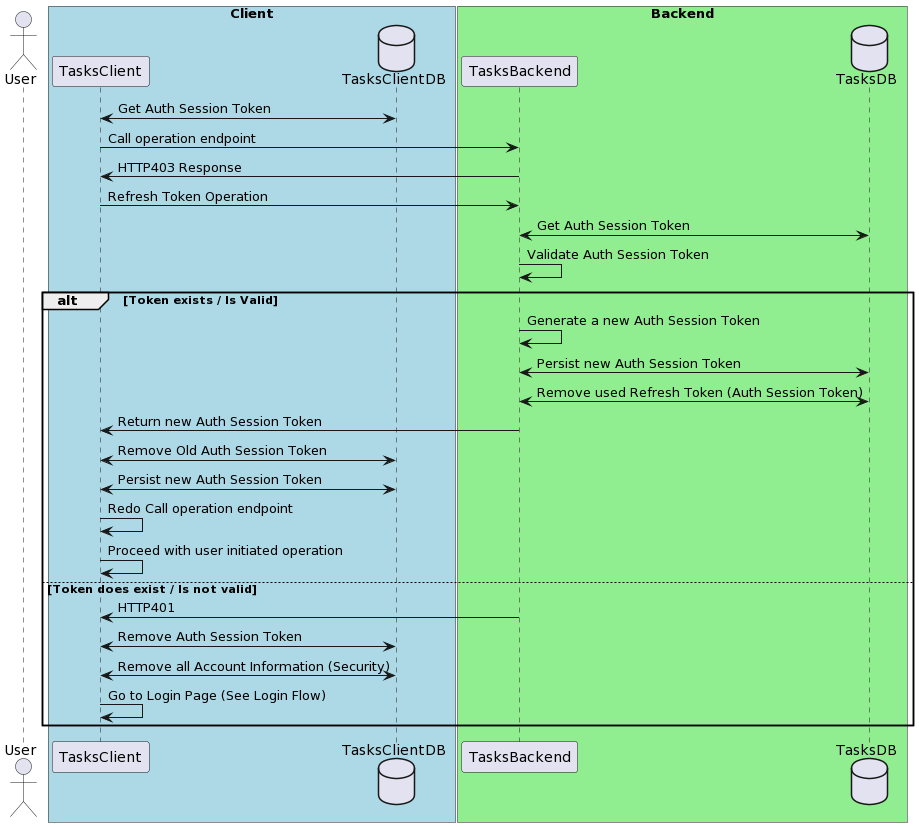

# Refresh Auth Token

## Description

This feature allows the users of the Apps (clients) to relogin without having to enter their information again. This information is restricted by time, meaning that the access token and refresh token are limited by a TTL of 1 hour and 5 days respectively, after that, the user will to do a full login with their username and password. 

## Problem Being Solved

Making easier the usage of the app with significant intervals between usages by not forcing the users to do a full login (with username and password) and to let the system deal with that by itself being opace for the user. 

## Sequence Diagram



### Sequence Diagram Code

```
@startuml

actor User
box "Client" #LightBlue
  participant TasksClient
  database TasksClientDB
end box

box "Backend" #LightGreen
  participant TasksBackend
  database TasksDB
end box

TasksClient <-> TasksClientDB: Get Auth Session Token
TasksClient -> TasksBackend: Call operation endpoint
TasksBackend -> TasksClient: HTTP403 Response
TasksClient -> TasksBackend: Refresh Token Operation
TasksBackend <-> TasksDB: Get Auth Session Token
TasksBackend -> TasksBackend: Validate Auth Session Token
alt Token exists / Is Valid
  TasksBackend -> TasksBackend: Generate a new Auth Session Token
  TasksBackend <-> TasksDB: Persist new Auth Session Token
  TasksBackend <-> TasksDB: Remove used Refresh Token (Auth Session Token)
  TasksBackend -> TasksClient: Return new Auth Session Token
  TasksClient <-> TasksClientDB: Remove Old Auth Session Token
  TasksClient <-> TasksClientDB: Persist new Auth Session Token
  TasksClient -> TasksClient: Redo Call operation endpoint
  TasksClient -> TasksClient: Proceed with user initiated operation
else Token does exist / Is not valid
  TasksBackend -> TasksClient: HTTP401 
  TasksClient <-> TasksClientDB: Remove Auth Session Token
  TasksClient <-> TasksClientDB: Remove all Account Information (Security)
  TasksClient -> TasksClient: Go to Login Page (See Login Flow)
end


@enduml
```
