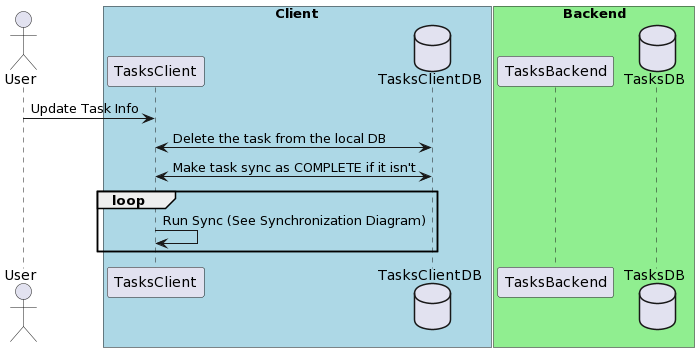

# Complete Task

## Description

Allow the user to complete / delete tasks.

## Problem Being Solved

A user wants to clear the completed tasks from the system so it easier to manage and
know what tasks are still to be done. 
is needed. 

## Sequence Diagram



```
@startuml

actor User
box "Client" #LightBlue
  participant TasksClient
  database TasksClientDB
end box

box "Backend" #LightGreen
  participant TasksBackend
  database TasksDB
end box

User -> TasksClient: Update Task Info
TasksClient <-> TasksClientDB: Delete the task from the local DB
TasksClient <-> TasksClientDB: Make task sync as COMPLETE if it isn't
loop 
  TasksClient -> TasksClient: Run Sync (See Synchronization Diagram)
end


@enduml
```