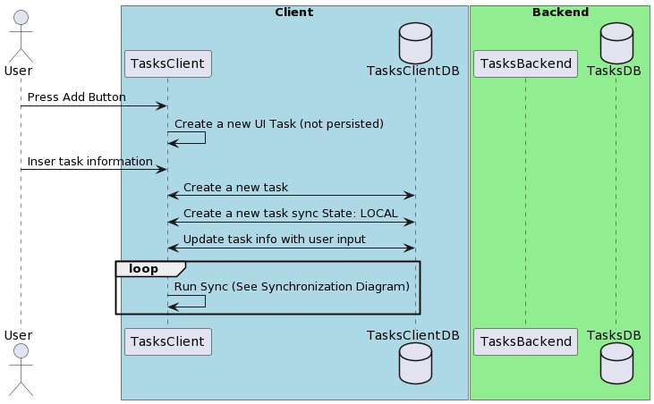

# Create Task

## Description

Allow the user to create a new task. 

## Problem Being Solved

A todo app that does not allow to add todos is not a very usefull todo app, in that sense
we allow the user to create / add a new task to their task list.

## Sequence Diagram




```
@startuml

actor User
box "Client" #LightBlue
  participant TasksClient
  database TasksClientDB
end box

box "Backend" #LightGreen
  participant TasksBackend
  database TasksDB
end box

User -> TasksClient: Press Add Button
TasksClient -> TasksClient: Create a new UI Task (not persisted)
User -> TasksClient: Inser task information
TasksClient <-> TasksClientDB: Create a new task
TasksClient <-> TasksClientDB: Create a new task sync State: LOCAL
TasksClient <-> TasksClientDB: Update task info with user input
loop 
  TasksClient -> TasksClient: Run Sync (See Synchronization Diagram)
end


@enduml
```