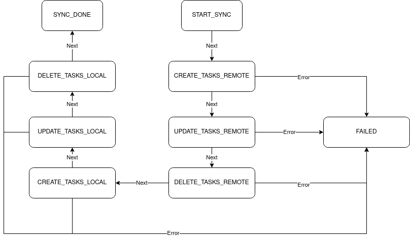
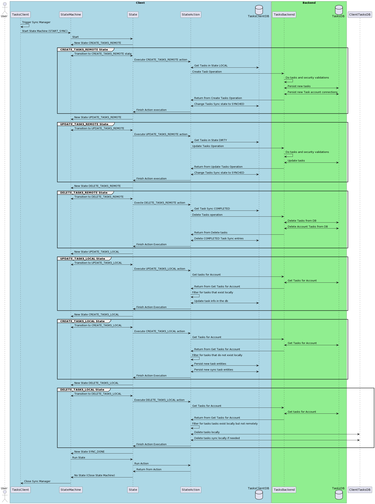

# Sync Tasks

## Description

Sync the Tasks between the Client and the Server, we chose to use a state
machine instead of a chain of responsibility f.ex, because the state machine can provide better state information in case of error or failures. 

## Problem Being Solved

In order for the user to not break their line of thought and to be able to take advantage
of the multiplatform nature of the Tasks apps we need to be able to transfer information
from lets say the Desktop to the Cellphone and in order to do that we need to syncrhonize
that information with the server. 

## State Machine



## Sequence Diagram




```
@startuml

actor User
box "Client" #LightBlue
  participant TasksClient
  participant StateMachine
  participant State
  participant StateAction
  database TasksClientDB
end box

box "Backend" #LightGreen
  participant TasksBackend
  database TasksDB
end box

TasksClient -> TasksClient: Trigger Sync Manager
TasksClient -> StateMachine: Start State Machine (START_SYNC)
StateMachine -> State: Start
State -> StateMachine: New State CREATE_TASKS_REMOTE
group CREATE_TASKS_REMOTE State
  StateMachine <-> State: Transition to CREATE_TASKS_REMOTE state
  State -> StateAction: Execute CREATE_TASKS_REMOTE action
  StateAction <-> TasksClientDB: Get Tasks in State LOCAL
  StateAction -> TasksBackend: Create Task Operation
  TasksBackend -> TasksBackend: Do tasks and security validations
  TasksBackend <-> TasksDB: Persist new tasks
  TasksBackend <-> TasksDB: Persist new Task account connections
  TasksBackend -> StateAction: Return from Create Tasks Operation
  StateAction <-> TasksClientDB: Change Tasks Sync state to SYNCHED
  StateAction -> State: Finish Action execution
end
State -> StateMachine: New State UPDATE_TASKS_REMOTE
group UPDATE_TASKS_REMOTE State
  StateMachine <-> State: Transition to UPDATE_TASKS_REMOTE
  State -> StateAction: Execute UPDATE_TASKS_REMOTE action
  StateAction <-> TasksClientDB: Get Tasks in State DIRTY
  StateAction -> TasksBackend: Update Tasks Operation
  TasksBackend -> TasksBackend: Do tasks and security validations
  TasksBackend <-> TasksDB: Update tasks
  TasksBackend -> StateAction: Return from Update Tasks Operation
  StateAction <-> TasksClientDB: Change Tasks Sync state to SYNCHED
  StateAction -> State: Finish Action execution
end
State -> StateMachine: New State DELETE_TASKS_REMOTE
group DELETE_TASKS_REMOTE State
  StateMachine <-> State: Transition to DELETE_TASKS_REMOTE
  State -> StateAction: Execte DELETE_TASKS_REMOTE action
  StateAction <-> TasksClientDB: Get Task Sync COMPLETED
  StateAction -> TasksBackend: Delete Tasks operation
  TasksBackend <-> TasksDB: Delete Tasks from DB
  TasksBackend <-> TasksDB: Delete Account Tasks from DB
  TasksBackend -> StateAction: Return from Delete tasks
  StateAction <-> TasksClientDB: Delete COMPLETED Task Sync entries
  StateAction -> State: Finish Action Execution
end
State -> StateMachine: New State UPDATE_TASKS_LOCAL
group UPDATE_TASKS_LOCAL State
  StateMachine <-> State: Transition to UPDATE_TASKS_LOCAL
  State -> StateAction: Execute UPDATE_TASKS_LOCAL action
  StateAction -> TasksBackend: Get tasks for Account
  TasksBackend <-> TasksDB: Get Tasks for Account
  TasksBackend -> StateAction: Return from Get Tasks for Account
  StateAction -> StateAction: Filter for tasks that exist locally
  StateAction <-> TasksClientDB: Update task info in the db
  StateAction -> State: Finish Action Execution
end
State -> StateMachine: New State CREATE_TASKS_LOCAL
group CREATE_TASKS_LOCAL State
  StateMachine <-> State: Transition to CREATE_TASKS_LOCAL
  State -> StateAction: Execute CREATE_TASKS_LOCAL action
  StateAction -> TasksBackend: Get Tasks for Account
  TasksBackend <-> TasksDB: Get Tasks for Account
  TasksBackend -> StateAction: Return from Get Tasks for Account
  StateAction -> StateAction: Filter for tasks that do not exist locally
  StateAction <-> TasksClientDB: Persist new task entities
  StateAction <-> TasksClientDB: Persist new sync task entities
  StateAction -> State: Finish Action Execution
end
State -> StateMachine: New State DELETE_TASKS_LOCAL
group DELETE_TASKS_LOCAL State
  StateMachine <-> State: Transition to DELETE_TASKS_LOCAL
  State -> StateAction: Execute DELETE_TASKS_LOCAL action
  StateAction -> TasksBackend: Get Tasks for Account
  TasksBackend <-> TasksDB: Get tasks for Account
  TasksBackend -> StateAction: Return from Get Tasks for Account
  StateAction -> StateAction: Filter for tasks tasks exist locally but not remotely
  StateAction <-> TasksClientDB: Delete tasks locally
  StateAction <-> TasksClientDB: Delete tasks sync locally if needed
  StateAction -> State: Finish Action Execution
end
State -> StateMachine: New State SYNC_DONE
StateMachine -> State: Run State
State -> StateAction: Run Action
StateAction -> State: Return from Action
State -> StateMachine: No State (Close State Machine)
StateMachine -> TasksClient: Close Sync Manager

@enduml
```