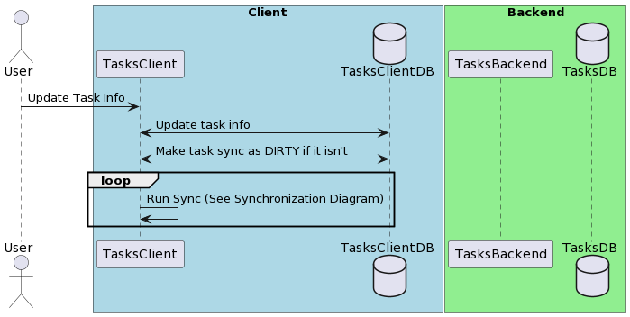

# Update Task

## Description

Allows the user to update the Task Information.

## Problem Being Solved

A user might want to change the task information because it no longer makes sense,
because it made a mistake or because there is something in the task itself that has changed, 
the use cases are several and varied. 

## Sequence Diagram



```
@startuml

actor User
box "Client" #LightBlue
  participant TasksClient
  database TasksClientDB
end box

box "Backend" #LightGreen
  participant TasksBackend
  database TasksDB
end box

User -> TasksClient: Update Task Info
TasksClient <-> TasksClientDB: Update task info
TasksClient <-> TasksClientDB: Make task sync as DIRTY if it isn't
loop 
  TasksClient -> TasksClient: Run Sync (See Synchronization Diagram)
end


@enduml
```
